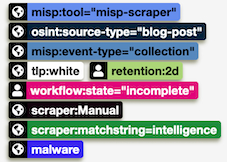
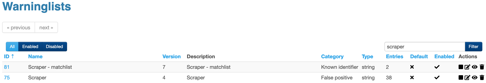
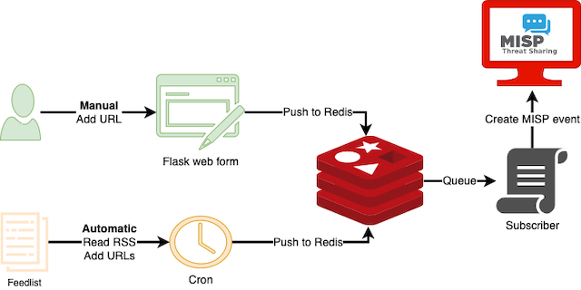
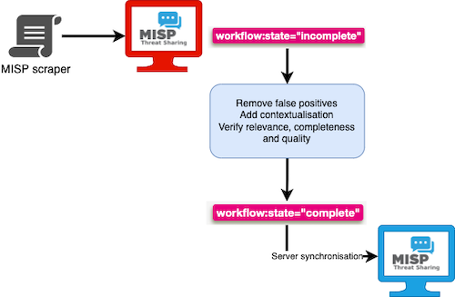
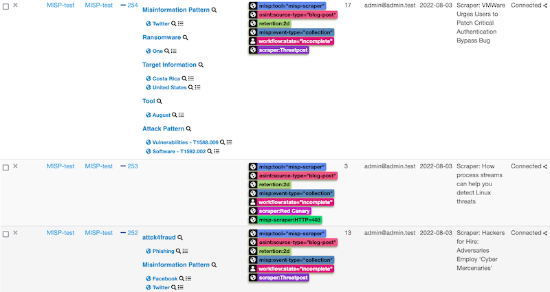
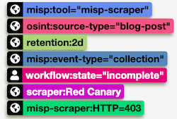
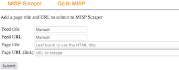

# MISP Scraper
A web scraper that turns web pages into MISP events and reports.

More details on the [MISP project website](https://www.misp-project.org/2022/08/08/MISP-scraper.html/).

The scraper is one of the core data collection components of zsazsa. Don't know what zsazsa is? zsazsa is a **CTI program management and production platform** built around MISP, see: [https://zsazsa-project.org/](https://zsazsa-project.org/).

# Docker

There is also a Docker version. One image covers the subscriber, the cron job and the Flask form, with `scraper.py`, the feed list and the log kept in a `config` volume. It connects to a Redis server you already run rather than starting one of its own.

The setup, configuration and day to day commands are documented in **[docker/README.md](docker/README.md)**. The MISP prerequisites below apply to the Docker version as well.

# Prerequisites

You need [MISP modules installed and enabled](https://github.com/MISP/misp-modules#how-to-install-and-start-misp-modules-in-a-python-virtualenv-recommended).

Enable `Plugin.Enrichment_html_to_markdown_enabled` under Administration, Server settings & maintenance, Plugin. This module fetches the HTML from an external URL. It also adds the 'Import from URL' button to the MISP Event Reports section.

You also need `Security.eventreport_enable_arbitrary_urls` set to 1, which you do from the CLI:

```
sudo -u www-data ../app/Console/cake Admin setSetting "Security.eventreport_enable_arbitrary_urls" 1
```

# Install

```
git clone https://github.com/cudeso/misp-scraper
cd misp-scraper
virtualenv venv
source venv/bin/activate
pip install -r requirements.txt
cp scraper.py.default scraper.py
```

Edit `scraper.py`, then install and enable the service scripts. The paths in the .service files point at `/var/www/MISP/misp-custom/misp-scraper`, so change them if you put the scraper somewhere else. Finally add the cron job.

# Run without a service script and without Flask

Useful when you are testing. Start the **subscriber** in one terminal, as the Apache user (`www-data`):

```
sudo -u www-data /var/www/MISP/misp-custom/misp-scraper/venv/bin/python /var/www/MISP/misp-custom/misp-scraper/misp-scraper.py subscribe
```

Then run the **cron** from a second shell:

```
sudo -u www-data /var/www/MISP/misp-custom/misp-scraper/venv/bin/python /var/www/MISP/misp-custom/misp-scraper/misp-scraper.py cron
```

You need both. The cron parses the feeds and publishes the URLs to Redis, the subscriber picks them up and creates the events.

# Submit raw HTML

Rather than scraping a site you can submit the raw HTML through the Flask web form. The scraper strips the HTML, converts it to Markdown and adds it as a MISP report, after which the attributes and context elements are extracted. On an existing setup you first have to install `markdownify` in the venv.

This was the first step towards fetching pages with something other than plain Python requests, see [issue 6](https://github.com/cudeso/misp-scraper/issues/6).

# Automatically delete scraped attributes

Not everything picked up from a page is worth keeping as a MISP attribute. 'Zone.Identifier' and 'http://google.com/ads/remarketingsetup' are typical examples.

After scraping a site, the scraper reads the entries of a warninglist (set with **misp_warninglist** in the config) and deletes the matching attributes from the event it just created. Deletion is soft or hard depending on **misp_hard_delete_on_cleanup**. This saves you removing the same attributes over and over from new events.

The warninglist has to be of type **string**. Do not forget to enable it.

# Only create events when specific strings are present

Sometimes you only want an event when the scraped data contains particular words. For example when you scrape a range of sources but only care about pages mentioning "intelligence" or "confidential".

The scraper builds a word list from a warninglist (set with **misp_warninglist_required_strings** in the config) and checks the scraped source against it. A match, either as a **full string** or as a **substring**, tags the event. If you set **autodelete_when_no_required_strings** to True, events without a match are deleted.

In short: to only create events when certain strings are present, put those keywords in the warninglist and set autodelete_when_no_required_strings to True. Leave it False if you just want matching events to be tagged.

The warninglist has to be of type **string**. Do not forget to enable it.




# Auto delete when assumed HTTP errors

Events can also be deleted automatically when the scraper assumes an HTTP error, for example when no content is returned or when the site answers with a 403. This is set with **autodelete_when_assumed_errors**.

# Screenshots










