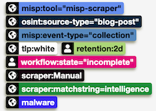
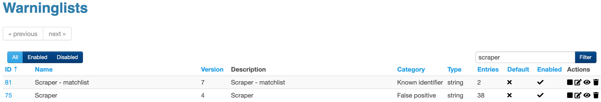

# MISP Scraper
A web scraper to create MISP events and reports

More details on the [MISP project website](https://www.misp-project.org/2022/08/08/MISP-scraper.html/).

# Prerequisites

[MISP modules installed and enabled](https://github.com/MISP/misp-modules#how-to-install-and-start-misp-modules-in-a-python-virtualenv-recommended).

# Install

```
git clone https://github.com/cudeso/misp-scraper
cd misp-scraper
virtualenv scraper
source scraper/bin/activate
pip install -r requirements.txt
cp scraper.py.default scraper.py
```

Then install and enable the service scripts (change the path /home/ubuntu to your MISP user).
Run the cron job.

# Submit raw HTML

Instead of scraping a site you can also submit the raw HTML via the Flask web form. The scraper will then strip the HTML and convert it to MarkDown. It is then added as a MISP report, after which the attributes and context elements are extracted. For existing setups, install `markdownify` in the venv.

This is the first step to using another 'scraper' instead of the regular Python requests - https://github.com/cudeso/misp-scraper/issues/6 .

# Automatically delete scraped attributes

Some elements from the scraped web site are not useful to be added as a MISP attribute, for example 'Zone.Identifier' and 'http://google.com/ads/remarketingsetup'. 

After scraping a website, the scraper reads the entries from one warninglist (defined via **misp_warninglist** in the config) and then (either hard or soft- **misp_hard_delete_on_cleanup**) deletes the matching attributes from the newly created MISP event. This avoids that you repeatedly have to delete the same attributes over and over from newly created events.

The warninglist needs to be of **string** type. Do not forget to enable this warninglist.

# Only create events when specific strings are present

It can be useful to only create a MISP event when there are specific strings present in the scraped data. For example if you're scraping sources and you only want to create an event when there is "intelligence" or "confidential" in the page.

The scraper can use a word list defined from the entries of a warninglist (defined via **misp_warninglist_required_strings** in the config) and then verify if the string is present in the scraped source. If there is a match, either as a **full string** or as a **substring**, then the event is tagged. If you set  **autodelete_when_no_required_strings** to True, then events are deleted if there is no match. To summarise, if you want to only create events when certain strings are present in the source, then add these keywords to the warninglist and set autodelete_when_no_required_strings to True. Leave autodelete_when_no_required_strings to False if you just want to have events tagged with matches against the substrings.

The warninglist needs to be of **string** type. Do not forget to enable this warninglist.




# Auto delete when assumed HTTP errors

You can now automatically delete events when there are (assumed) HTTP errors. For example when no conent is returned or when an HTTP 403 message is returned.

# Screenshots


